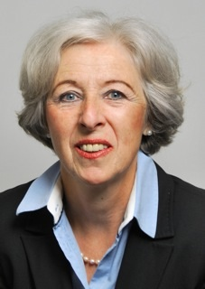

# Perfil

A  proprietária de __Mehring Translations__ é a tradutora diplomada alemã __Veronika Mehring–von Lillienskiold.__

__Veronika Mehring–von Lillienskiold__ formou-se nas universidades de Heidelberg, Lisboa e Nice para tradutora diplomada de Português e Francês (com a especialidade de direito).

Antes de vir para a Holanda há mais de 30 anos, trabalhou como tradutora autarca e intérprete ajuramentada de Português e Francês na Alemanha. Depois de ter feito um exame adicional para Holandês na universidade de Leiden, especializou-se em traduções do Holandês para o Alemão, principalmente de textos jurídicos.

- linguas: Alemão (língua materna), Holandês, Português e Francês
- desde 1975 traduções do Português e do Francês para o Alemão
- desde ca. 1985 também traduções do Holandês para o Alemão
- cerca de 15 anos de experiência como professora de Alemão em empresas e pessoas particulares
- em 2003 ajuramentada para o Alemão no tribunal de comarca da Haia
- em 2009 inscrita no registo holandês _Register Beëdigde Tolken en Vertalers (RBTV)_
- em 2012 inscrita no registo da _Câmara de Comércio da Haia_ sob o _nr. 55086764_

## Participação nas asscociações seguintes

- 1975 – 1980 membro do _Bundesverband der Dolmetscher und Übersetzer e.V. (BDÜ)_
- em 1990 filiou-se à _<a href="http://www.ngtv.nl/" target="_blank">Nederlandse Genootschap van Tolken en Vertalers (NGTV)</a>_
- faz parte do _Duitse Kring_ e do _Taalkring Portugees_, ambos sub-organizações da _NGTV_
- membro da _Deutsche Bibliothek_ e da _Genootschap Nederland-Duitsland_
