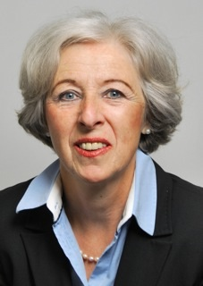

# Profil

Eigenares van __Mehring Translations__,  de Duitse Diplom-Übersetzerin __Veronika Mehring-von Lillienskiold,__  heeft aan de universiteiten van Heidelberg, Lissabon en Nice  haar opleiding tot gediplomeerde vertaalster Portugees en Frans (met als speciaal vak rechten) gevolgd.

Voordat zij meer dan 30 jaar geleden in Nederland kwam wonen, was zij in Duitsland freelance vertaalster en beëdigde gerechtstolk voor Portugees en Frans. Na een aanvullend tentamen voor de Nederlandse taal aan de universiteit Leiden te hebben afgelegd,  is Veronika Mehring zich gaan specialiseren op vertalingen  uit het Nederlands, in het bijzonder van juridische teksten.

- talen: Duits (moedertaal), Nederlands, Portugees, Frans
- sinds 1975 vertalingen Duits, Frans en Portugees
- sinds ca. 1985 ook vertalingen Nederlands-Duits
- ca. 15 jaar ervaring als docente Duits voor ondernemingen en particulieren
- in 2003 beëdigd voor Duits aan het Gerechtshof van Den Haag
- in 2009 opgenomen in het _Nederlands Register Beëdigde Tolken en Vertalers  (RBTV), (Wbtv 2339)_
- in 2012 geregistreerd bij de _Kamer van Koophandel Den Haag_ onder nummer _KvK 55086764_

## Lidmaatschappen

- 1975 – 1980 lid van de _Bundesverband der Dolmetscher und Übersetzer  e.V. (BDÜ)_
- sinds 1990 lid van de _<a href="http://www.ngtv.nl/" target="_blank">Nederlandse Genootschap van Tolken en Vertalers (NGTV)</a>_
- lid van de _Duitse Kring en de Taalkring Portugees_, beide taalkringen binnen het _NGTV_
- lid van de _International Women´s Contact (IWC)_
- lid van de _Duitse Bibliotheek en de Genootschap Nederland-Duitsland_
